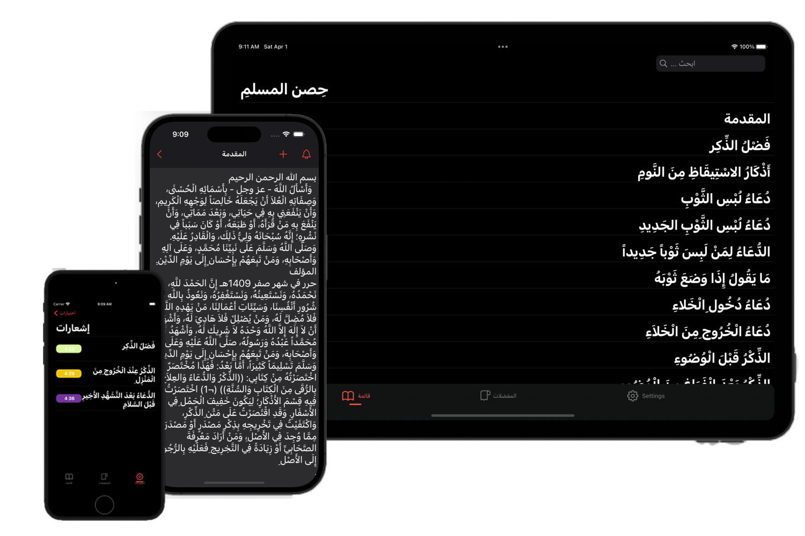

<h1 style="margin-right: 100px;" align="center"> 
  حِصن المسلمِ
</h1>
<p align="center">
  
  
  
</p>

</br>

## Introduction

**`Hisnul Muslim iOS App`** is a digital version of the popular book of supplications and prayers for Muslims. It provides easy access to a collection of authentic prayers and supplications that are derived from the Quran and Sunnah, which are the teachings and practices of the Prophet Muhammad (peace be upon him).

The app features a user-friendly interface with supplications organized thematically, covering topics such as morning and evening supplications, prayers for specific occasions, and supplications for protection and seeking guidance.

The "حِصن المسلمِ" app is designed to be a convenient tool for Muslims to have access to a collection of authentic supplications at their fingertips, whether at home, work, or on-the-go.



## Features

- [x] 100+ supplications
- [x] Swift `%100`
- [x] UIKit Programmatic UI
- [x] Combine Framework
- [x] MVVM design pattern
- [x] Bookmark supplications
- [x] Search supplications
- [x] Notification supplications based on user's time request using `UNUserNotificationCenter`
- [x] Store supplications in `Core Data` with Notification time
- [x] Supports iPhone and iPad
- [x] iPhone SE support
- [x] Supports iOS 15.0 and above
- [x] Dark Mode and Light Mode
- [x] Improved AlertVC with multiple button options.
- [x] Enhanced Empty State handling
- [x] Async/Await for better readability
- [x] Improved file reading using Combine's Just Publisher

### Improved Bundle Extension

The Bundle extension has been improved to use Combine for reading files:

```swift
import Foundation
import Combine

extension Bundle {
    func readFile(_ file: String) -> AnyPublisher<Data, HSErrors> {
        guard let fileURL = self.url(forResource: file, withExtension: nil) else {
            return Fail(error: HSErrors.fileNotFound).eraseToAnyPublisher()
        }
        
        return Just(fileURL)
            .tryMap { try Data(contentsOf: $0) }
            .mapError { _ in HSErrors.unableToReadFile }
            .eraseToAnyPublisher()
    }
    
    func decodable<T: Decodable>(type Model: T.Type, _ fileName: String) -> AnyPublisher<T, HSErrors> {
        readFile(fileName)
            .decode(type: T.self, decoder: JSONDecoder())
            .mapError { _ in HSErrors.unableToReadFile }
            .eraseToAnyPublisher()
    }
}
```

## Requirements

- iOS 15.0+
- Xcode 15.0+
- Swift 5.0+


## why I created this app?

the main reason I created this app is give free access to supplications and prayers for Muslims without any ads or in-app purchases, and I hope this app will help you to learn more about the supplications and prayers.

## Contributing

If you have any suggestions or ideas, please feel free to open an issue or pull request.

but before that, please read the [contribution guidelines](./CONTRIBUTING.md) first.

## License

This project is licensed under the MIT License - see the [LICENSE](./LICENSE.md) file for details.

## Download

- [Hisnul Muslim iOS App](https://apps.apple.com/us/app/hisnul-muslim/id6447127371)

## Contact

- [LinkedIn](https://linkedin.com/in/abdorizak)
- [Twitter](https://twitter.com/abdorizak)
- [Gmail](mailto:cabdirizaaqyare12@gmail.com)
- [abdorizak.dev](https://abdorizak.dev)

## Author

- [Abdorizak Abdalla 🍎](https://linkedin.com/in/abdorizak)
- © Copyright 2023 Abdorizak Abdalla. All rights reserved.

